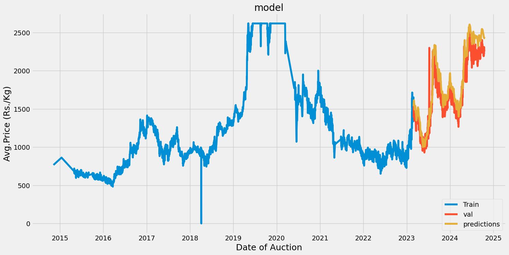

# Cardamom Price Forecasting

Commodity markets are influenced by various factors such as geopolitical events, economic conditions, and supply-demand dynamics. This project analyzes these price movements using historical data and advanced modeling techniques like Exponential Smoothing, Vector Autoregression Moving-Average with eXogenous inputs (VARMAX), and Long Short-Term Memory (LSTM) networks. The project combines time series and machine learning approaches to model and predict price trends.

##  Problem Statement
Accurately forecasting commodity prices is crucial for investors, policymakers, and businesses. This project uses advanced data analysis and machine learning techniques to identify underlying patterns and predict future price movements in the market.

## Data Source:
 Ensure you have an Excel file containing the Cardamom auction data with columns like .

 Here are the columns in your dataset:

- Date of Auction
- Auctioneer
- No. of Lots
- Total Qty Arrived (Kgs)
- Qty Sold (Kgs)
- Max Price (Rs./Kg)
- Avg. Price (Rs./Kg)

## repository contains 
This repository contains Python code for forecasting Cardamom prices using various time series forecasting techniques, including:

Simple Exponential Smoothing (SES)

Double Exponential Smoothing (DES)

Random Forest Regressor 

(Commented out) VARMAX 

(Commented out) Multivariate LSTM

(Commented out) Univariate LSTM

Any additional information goes here
## Prerequisites
Python Libraries:

- pandas – For data handling and manipulation.
- numpy – For numerical operations.
- matplotlib and seaborn – For data visualization.
- scikit-learn – For data preprocessing, modeling, and evaluation.
- statsmodels – For statistical analysis and time series modeling.
- tensorflow or keras (if using neural networks) – For building and training LSTM models.

Python Version:
- Python 3.7 or later.

## Jupyter Notebook or IDE:
 Jupyter Notebook, Google Colab, or an IDE like VS Code or PyCharm for running the code.

## Data Preprocessing:
 Missing values handling, date formatting, and data scaling may need to be done before analysis.

## System Requirements:
 A machine with adequate RAM and processing power, especially if training deep learning models (LSTM).
## Screenshots

Additional Considerations:

For more complex time series patterns, consider advanced techniques like ARIMA, SARIMA, or Prophet.
Explore feature engineering techniques to extract meaningful information from the data.
Regularly retrain and update your models to adapt to changing trends and patterns.

Note:

The commented-out sections for VARMAX and LSTM models require further implementation and configuration.
